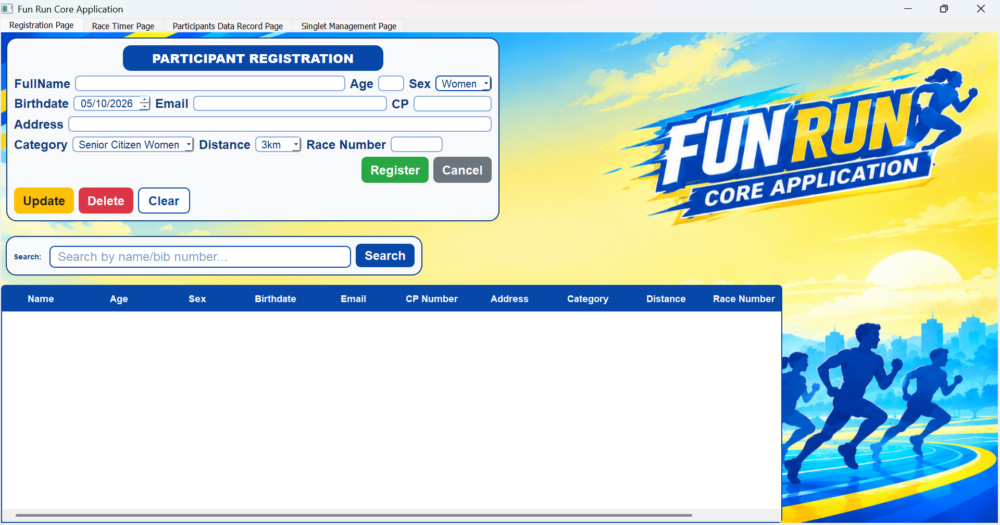
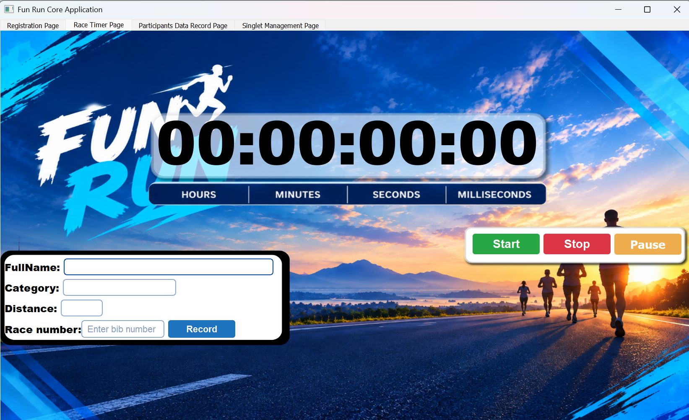
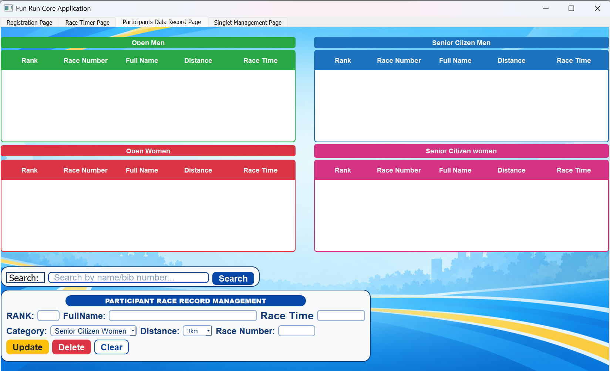
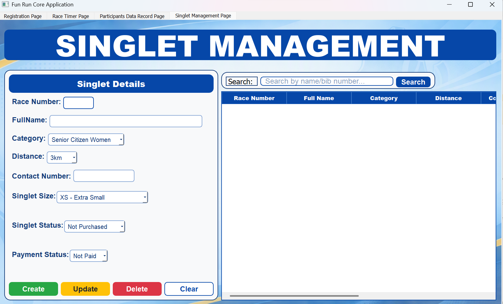

# FUN RUN CORE APPLICATION SYSTEM

## Project Title

# FUN RUN CORE APPLICATION SYSTEM

**FUN RUN CORE APPLICATION SYSTEM — A Desktop Application for Managing Fun Run Participants, Race Results, and Singlet Records Using PyQt5 and SQLite.**

## Project Description

The Fun Run Core Application System is a desktop application that I created to help organizers manage a fun run event.

The main purpose of this system is to replace the paper-based process of writing and recording participant information, race results, and singlet information.

When information is written on paper, it can be difficult to manage many participants. Records can also be lost, damaged, or difficult to find when a participant has a question or complaint.

This application keeps the participant information and race records in one database. It can help the organizer check the participant information, race number, race result, category, distance, and singlet information.

The records can also be used as evidence or reference if a participant has a complaint or needs to verify their information or race result.

I know that there are more advanced systems than this application. However, my project is mainly made to help small communities or barangays that organize fun run events. The goal is to make the process more organized and easier for the organizer to manage.

## Project Objectives

The main objectives of my project are:

- To replace the paper-based process of recording participants and race information.
- To make participant records more organized and easier to manage.
- To make it easier for organizers to search and check participant information.
- To record and manage race results using a database.
- To provide records that can be used as a reference when participants have questions or complaints.
- To manage singlet and payment information.
- To help small communities or barangays organize fun run events in a simple and easier way.
- To reduce the difficulty of managing many records manually.

## Features

The major functions of the system are:

- **Participant Registration** – Allows organizers to add and save participant information such as name, age, category, distance, and race number.
- **Participant Search** – Allows organizers to search for a participant using their name or race number.
- **Participant Update and Delete** – Allows organizers to update or delete participant records when needed.
- **Race Timer** – Allows organizers to enter a race number, automatically get the participant information, and record the participant's race time.
- **Race Result Management** – Allows organizers to view, update, search, and delete race results.
- **Singlet Management** – Allows organizers to manage singlet size, singlet status, and payment status.    
- **Database Storage** – Stores participant, race result, and singlet records in a SQLite database.

## Technologies Used

**Programming Language:** Python 3.14
**GUI Framework/Library:** PyQt5
**Database:** SQLite
**Other Libraries and Tools:**
   - PyQt5 `uic` for loading the UI designed in Qt Designer
   - SQLite3 for connecting and managing the database
   - Qt Designer for designing the user interface
   - Visual Studio Code for writing and running the project

## Project Structure

```text
Fun_Run_Core_Application
│
├── background
│   ├── FirstBackground.png
│   ├── FourthBackground.png
│   ├── SecondBackground.png
│   └── ThirdBackground.png
│
├── database
│   └── database.py
│
├── features
│   ├── participantsDataRecordFrontPage
│   │   ├── participantsDataRecordPage.py
│   │   └── participantsDataRecordUi.ui
│   │
│   ├── raceTimerFrontPage
│   │   ├── raceTimerPage.py
│   │   └── raceTimerUi.ui
│   │
│   ├── registrationFrontPage
│   │   ├── model.py
│   │   ├── registrationBg.ui
│   │   ├── registrationPage.py
│   │   ├── repository.py
│   │   └── service.py
│   │
│   └── singletManagementFrontPage
│       ├── singletManagement.ui
│       └── singletManagementPage.py
│
├── main_window.py
├── main.py
├── FunRun.db
├── .gitignore
├── myappvenv
└── README.md
```

## Purpose of the Major Folders and Files

- **background** – Contains the background images used by the different pages.
- **database** – Contains the database code used to create and manage the database tables.
- **features** – Contains the different features or pages of the application.
- **participantsDataRecordFrontPage** – Handles viewing, searching, updating, and deleting race results.
- **raceTimerFrontPage** – Contains the race timer page and its UI file.
- **registrationFrontPage** – Contains the participant registration feature and its supporting files.
- **singletManagementFrontPage** – Contains the singlet and payment management feature.
- **registrationPage.py** – Handles the registration page and user actions.
- **model.py** – Defines the participant data structure.
- **repository.py** – Handles database operations for participant records.
- **service.py** – Handles validation and the participant create, update, and delete processes.
- **registrationBg.ui** – Contains the registration page design made in Qt Designer.
- **raceTimerPage.py** – Handles the race timer functions.
- **raceTimerUi.ui** – Contains the race timer interface design.
- **participantsDataRecordPage.py** – Handles the display and management of race results.
- **participantsDataRecordUi.ui** – Contains the participant data record interface design.
- **singletManagementPage.py** – Handles singlet record management.
- **singletManagement.ui** – Contains the singlet management interface design.
- **main_window.py** – Creates the main window and connects the different pages.
- **main.py** – Starts the application.
- **FunRun.db** – SQLite database that stores the participant, race result, and singlet records.
- **.gitignore** – Lists files and folders that should not be included in Git.
- **README.md** – Contains the documentation for the project.

## Installation and Setup

### Requirements

- Python 3.14
- PyQt5
- Visual Studio Code
- Windows operating system

### Setup Steps

1. Download or clone the project from the GitHub repository.
2. Open the `Fun_Run_Core_Application` folder in Visual Studio Code.
3. Open the terminal in Visual Studio Code.
4. Create a virtual environment:

```bash
python -m venv myappvenv

Dependencies
- Python 3.14 – Programming language used for the project.
- PyQt5 – Used to create the graphical user interface.
- SQLite – Used as the database for storing system records.
- sqlite3 – Python built-in library used to connect to the SQLite database.
```

### How to Use the System

1. Run the application using `python main.py`.

2. The **Registration Page** will appear first.
   - Enter the participant's information.
   - Click **Register** to save the participant.
   - Use **Search** to find a participant.
   - Use **Update** to change participant information.
   - Use **Delete** to remove a participant.
   - Use **Clear** or **Cancel** to clear the input fields.

3. Click the **Race Timer Page** when you are ready to record a participant's race time.
   - Enter the participant's race number.
   - The participant's name, category, and distance will automatically appear.
   - Click **Start** to begin the timer.
   - Use **Pause** or **Stop** when needed.
   - Click **Record** to save the race result.

4. Click the **Participants Data Record Page** to view and manage race results.
   - View the recorded race results.
   - Search for a race result.
   - Select a result to update it.
   - Delete a race result when needed.
   - Use **Clear** to clear the fields.

5. Click the **Singlet Management Page** to manage singlet records.
   - View participant and singlet information.
   - Select a participant from the table.
   - Select the singlet size.
   - Set the singlet status.
   - Set the payment status.
   - Use **Create**, **Update**, or **Delete** to manage singlet records.

6. All participant, race result, and singlet records are stored in the `FunRun.db` SQLite database.

## OOP Implementation

The project uses Object-Oriented Programming (OOP) to organize the system into different classes and objects.

### Important Classes and Objects

- **Participant** – Represents the participant information such as name, age, sex, birthdate, email, contact number, address, category, distance, and race number.

- **ParticipantService** – Handles the rules and processes for registering, updating, and deleting participants.

- **ParticipantRepository** – Handles the database operations for participant records.

- **Database** – Handles the connection to the SQLite database and the database operations.

- **RegistrationPage** – Handles the participant registration user interface.

- **RaceTimerPage** – Handles the race timer and recording of race results.

- **ParticipantsDataRecordPage** – Handles viewing and managing race results.

- **SingletManagementPage** – Handles singlet and payment records.

- **MainWindow** – Creates the main application window and connects the different pages.

### Encapsulation

Encapsulation is applied by placing data and related functions inside classes.

For example, the `Participant` class contains the participant information, while `ParticipantService` contains the processes for registering, updating, and deleting participants.

The classes also keep their functions organized so that each class has its own responsibility.

### Inheritance

Inheritance is used in the PyQt5 pages.

For example:

- `RegistrationPage` inherits from `QMainWindow`.
- `RaceTimerPage` inherits from `QMainWindow`.
- `ParticipantsDataRecordPage` inherits from `QMainWindow`.
- `SingletManagementPage` inherits from `QMainWindow`.
- `MainWindow` inherits from `QMainWindow`.

This allows the pages to use the functions and behavior provided by the PyQt5 `QMainWindow` class.

### Polymorphism

Polymorphism can be seen through the different page classes that inherit from `QMainWindow`. These classes share common behavior from `QMainWindow`, but each page has its own functions and behavior depending on its purpose.

For example, `RegistrationPage`, `RaceTimerPage`, `ParticipantsDataRecordPage`, and `SingletManagementPage` all inherit from `QMainWindow`, but they perform different tasks in the application.

The project uses this basic form of polymorphism through the different page classes, while each class provides its own functionality for the specific part of the system.

## Database

The project uses **SQLite** as the database for storing and managing the records of the FUN RUN CORE APPLICATION SYSTEM.


### Database Structure

The database is stored in the `FunRun.db` file. It contains separate tables for participant information, race results, and singlet records.

The main tables are:

- **participants** – Stores the personal and race information of registered participants.
- **race_results** – Stores the race results of participants, including their race time.
- **singlet_records** – Stores singlet information and payment status.

### Important Tables

#### `participants`

This table stores the main participant information.

Important fields include:

- `id` – Unique ID of the participant.
- `name` – Participant's full name.
- `age` – Participant's age.
- `sex` – Participant's sex.
- `birthdate` – Participant's birthdate.
- `email` – Participant's email address.
- `cpnumber` – Participant's contact number.
- `address` – Participant's address.
- `category` – Participant's race category.
- `distance` – Selected race distance.
- `race_number` – Participant's unique race number.

#### `race_results`

This table stores the race results.

Important fields include:

- `id` – Unique ID of the race result.
- `race_number` – Participant's race number.
- `name` – Participant's name.
- `category` – Participant's category.
- `distance` – Race distance.
- `race_time` – Recorded race time.

#### `singlet_records`

This table stores the participant's singlet and payment information.

Important fields include:

- `id` – Unique ID of the singlet record.
- `race_number` – Participant's race number.
- `name` – Participant's name.
- `category` – Participant's category.
- `distance` – Race distance.
- `cpnumber` – Participant's contact number.
- `singlet_size` – Selected singlet size.
- `singlet_status` – Status of the singlet.
- `payment_status` – Payment status.

### Major Database Operations

The system performs the following major database operations:

- **Create** – Adds new participant records, race results, and singlet records to the database.

- **Read** – Retrieves participant information, race results, and singlet records from the database and displays them in the system.

- **Update** – Changes existing participant, race result, and singlet information when updates are needed.

- **Delete** – Removes participant, race result, or singlet records from the database when they are no longer needed.

- **Search** – Searches for participant and race result information using details such as the participant's name or race number.

These database operations allow the system to store, manage, and retrieve the records needed for the fun run event.

## Screenshots

The following screenshots show the important parts of the working FUN RUN CORE APPLICATION SYSTEM.

### Registration Page

This page is used to register participants and manage their participant information. It allows the organizer to add, search, update, and delete participant records.



### Race Timer Page

This page is used to record the race time of a participant. The organizer enters the race number, and the participant's information is automatically displayed.



### Participants Data Record Page

This page displays the recorded race results. It allows the organizer to view, search, update, and delete race result records.



### Singlet Management Page

This page is used to manage participant singlet information, including singlet size, singlet status, and payment status.



 ### Testing

The system was tested by checking the important features and verifying if they worked correctly.

| No. | Feature                  | Expected Result                                      | Actual Result                         | Status |
| --- | ------------------------ | ---------------------------------------------------- | ------------------------------------- | ------ |
| 1   | Participant Registration | Participant information is saved.                    | Information was saved successfully.   | Passed |
| 2   | Participant Search       | The correct participant is displayed.                | Participant was found successfully.   | Passed |
| 3   | Participant Update       | Participant information is updated.                  | Information was updated successfully. | Passed |
| 4   | Participant Delete       | The selected participant is deleted.                 | Participant was deleted successfully. | Passed |
| 5   | Race Timer               | The timer starts and records the race time.          | Timer worked correctly.               | Passed |
| 6   | Race Result              | The race result is saved in the database.            | Race result was saved successfully.   | Passed |
| 7   | Race Result Search       | The correct race result is displayed.                | Race result was found successfully.   | Passed |
| 8   | Singlet Management       | Singlet and payment information is saved or updated. | Singlet record worked correctly.      | Passed |
| 9   | Database Operations      | Records can be added, viewed, updated, and deleted.  | Database operations worked correctly. | Passed |

## System Testing Results

The system was tested by verifying its major functionalities and comparing the expected results with the actual outcomes. All features, including participant management, race timing, race result processing, singlet management, and database operations, performed as intended. Therefore, all test cases were marked as Passed, indicating that the system functions correctly and meets its intended requirements.

## Known Issues / Limitations

The system is working, but there are still some limitations:

- The system is currently designed as a desktop application and is not available as a mobile or web application.
- The system requires Python, PyQt5, and the required setup before it can be run.
- The system does not have a login or user account feature.
- The race timer depends on the participant's race number being correctly entered.
- The system is mainly designed for small fun run events and may need further improvements for larger events.
- The system does not yet have an automatic backup or online database feature.

## Author

- **Name:** Morly Boy G. Ylanan
- **Section:** CS26L(3581)